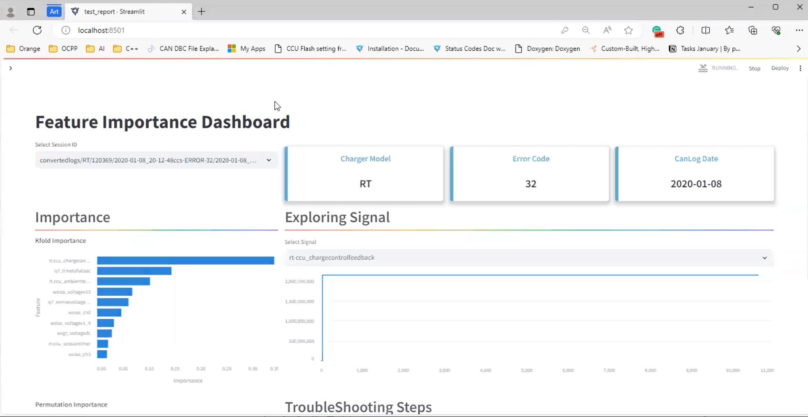

# CanLog Analyser README

This Streamlit application is designed to help on the analsys of CANlogs by using unsupervised learning 
and feature importance.


[](https://drive.google.com/file/d/1l2o_gAu74I6K62RZyPR7UiA9fkQwZUsZ/view?usp=sharing)

## Prerequisites

Before running the application, ensure you have the following prerequisites installed:

- Python 3.8+
- pip (Python package manager)

## Settings up
1. Data
   ```bash
   Send email to mgl.retamozo@gmail.com asking for data to analyse.
   ```

2. Cloning and instalation

   ```bash
   git clone https://github.com/mangele/AnomallyDetection-Dashboard
   python3.8 -m venv env
   source env/bin/activate
   python install -r requirements.txt
   streamlit run run_app.py
   ```
3. Authentication
   ```bash
   username: mretamozo
   password: 1qaz5thn
   ```
	
